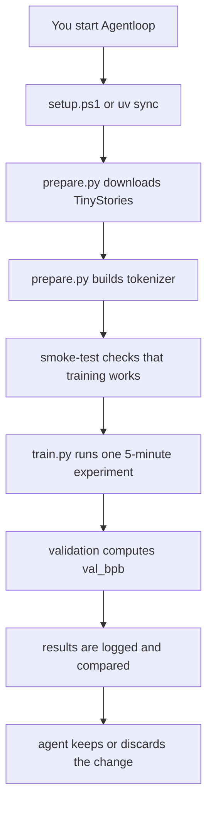

# Agentloop

> Turn a single Windows RTX desktop into a small autonomous AI research loop.

Agentloop is a Windows-friendly fork of [karpathy/autoresearch](https://github.com/karpathy/autoresearch). It is set up so a local agent can edit `train.py`, run a fixed 5-minute training experiment, measure the result, and keep iterating.

This repository was validated locally on:

- Windows 11
- NVIDIA RTX 4070 12 GB
- Python 3.10.17
- `uv` 0.7.9
- PyTorch CUDA 12.8 wheels

On this machine, the reliable first-run path is:

- dataset: `TinyStories`
- tokenizer: Windows-safe byte tokenizer
- training budget: 5 minutes per experiment


## Start here

If you want the shortest path from "fresh checkout" to "working run", use these PowerShell scripts:

```powershell
.\scripts\setup.ps1
.\scripts\smoke-test.ps1
.\scripts\run-once.ps1
```

If you prefer raw commands instead of helper scripts:

```powershell
uv sync
uv run prepare.py
uv run train.py --smoke-test
uv run train.py
```

The helper scripts print plain-English explanations while they run, so they are a good default if you are coming back to the project cold.

If PowerShell blocks direct script execution on your machine, use:

```powershell
powershell -ExecutionPolicy Bypass -File .\scripts\setup.ps1
```

## What each step is doing

- `uv sync`
  Layman version: this stocks the toolbox. It installs the exact Python packages the repo expects.
- `uv run prepare.py`
  Layman version: this downloads the practice text and builds the text-to-number dictionary the model uses.
- `uv run train.py --smoke-test`
  Layman version: this is a short engine test. It makes sure the parts are wired together before a full run.
- `uv run train.py`
  Layman version: this is one full 5-minute experiment.

## Visual map



## Why this fork exists

The original upstream project is aimed at a Linux/H100-style workflow. On a normal Windows desktop, the hardest part is usually not the Python itself. The hard part is getting the GPU, PyTorch, CUDA wheels, native extensions, and platform-specific code paths to all agree with each other.

In everyday terms, the GPU is the heavy machinery. If the software and the machinery do not agree on the exact handshake, nothing useful happens even if the Python code looks fine. This repo keeps the working path simple on Windows by using official PyTorch CUDA wheels, SDPA attention, and a byte-tokenizer default on Windows.

## What changed to make this machine work

- Switched first-run tokenizer behavior on Windows to `byte` mode for reliability.
- Kept the dataset on `TinyStories`, which is much more practical for local single-GPU runs.
- Verified the full flow end to end on an RTX 4070 12 GB.
- Published the working state to [Datakult0r/Agentloop](https://github.com/Datakult0r/Agentloop).

## What you give up to fit 12 GB VRAM

You are not giving up the whole project. You are mostly giving up scale.

- Smaller model and batch settings mean each experiment sees less work per step.
- A byte tokenizer is simpler and more robust, but it is less text-efficient than a learned BPE tokenizer.
- Your local results are still real, but they are tuned for your machine instead of matching a large datacenter baseline.

The upside is that the project is actually runnable, repeatable, and easy to iterate on locally.

## Validated baseline on this machine

The current published baseline was run successfully on this machine with `TinyStories` and the Windows-safe byte tokenizer path.

| Metric | Value |
| --- | --- |
| `val_bpb` | `2.269272` |
| `training_seconds` | `302.8` |
| `total_seconds` | `471.4` |
| `peak_vram_mb` | `957.3` |
| `num_steps` | `49` |
| `num_params_M` | `26.0` |

That means the working baseline uses well under the 12 GB VRAM limit and leaves room for future experiments.

## Files that matter

- `prepare.py`
  Fixed constants, one-time data prep, tokenizer prep, dataloader, and evaluation.
- `train.py`
  The single file the agent is meant to change during experiments.
- `program.md`
  The human-written operating instructions for the agent.
- `scripts/`
  Friendly PowerShell wrappers for setup, validation, and a full run.
- `docs/WINDOWS_OPERATOR_GUIDE.md`
  A more detailed guide in plain English, including diagrams and practical tradeoffs.

## Daily workflow

1. Open PowerShell in the repo.
2. Run `.\scripts\status.ps1` to see whether the environment and cache look healthy.
3. Run `.\scripts\smoke-test.ps1` if you want a quick confidence check.
4. Run `.\scripts\run-once.ps1` for one full experiment.
5. If you want the agent to do research loops, point it at `program.md`.

## Detailed guide

For a fuller explanation of what the GPU stack is doing, what the tokenizer change means, and what the 12 GB tradeoffs are, read [docs/WINDOWS_OPERATOR_GUIDE.md](docs/WINDOWS_OPERATOR_GUIDE.md).

## Upstream

- Upstream source: [karpathy/autoresearch](https://github.com/karpathy/autoresearch)
- This repo focuses on Windows plus consumer RTX practicality.
- If you want the original Linux/H100-oriented path, use upstream directly.

## License

MIT
