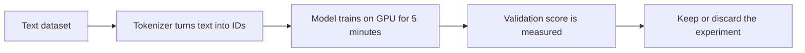

# Windows Operator Guide

This guide explains Agentloop in plain English for a normal desktop workflow.

## The short version

Agentloop is a loop with four jobs:

1. Download text data.
2. Convert that text into numbers the model can read.
3. Train for 5 minutes.
4. Measure whether the change helped.

If it helped, keep it. If it did not, throw it away and try something else.

## Visual overview



## What the GPU is doing

Think of the GPU as a factory machine built to do huge amounts of math in parallel. The Python code is just the manager giving instructions. The hard part is that the manager and the factory machine have to agree exactly on:

- the language they use
- the features that are available
- the memory limits
- the special fast paths that are allowed

If any of those are mismatched, the code may start but still crash, hang, or silently use the wrong path.

## Why "talking to the graphics card" is usually the hardest part

This is the part that tends to break first on local AI setups because several layers have to line up at once:

- NVIDIA driver
- CUDA-compatible PyTorch wheel
- the exact GPU model and its memory size
- Windows-specific behavior
- any native extension or custom kernel code

Layman version: it is like trying to connect a trailer, hitch, wiring harness, and brake lights from different manufacturers. The job is not conceptually deep, but every connector has to match.

On Linux servers with datacenter GPUs, many projects are tested on a narrower and more standardized hardware path. On a home Windows machine, you usually hit more edge cases.

## What it means to "change the training data"

Training data is the pile of text examples the model practices on.

In this repo, we use `TinyStories`, which is much smaller and lighter than a giant internet-scale corpus. That means:

- it downloads faster
- it prepares faster
- it trains faster
- it is practical for a single local GPU

What you give up is breadth. A tiny dataset teaches less about the world than a huge one. But for local experiments, it is a very good trade: you get a setup that can actually run end to end.

## What it means to "build the tokenizer"

A tokenizer is the dictionary that turns text into machine-readable pieces.

Example idea:

- human text: `The cat sat.`
- tokenizer output: a list of numbers

The model never reads raw letters directly. It reads those numbers.

There are two common styles:

- BPE tokenizer
  Smarter and more compact. It learns common chunks like `ing`, `tion`, or whole words.
- Byte tokenizer
  Simpler and more universal. It works directly from raw bytes.

## Why this repo uses a byte tokenizer on Windows

The original BPE training path was the brittle part on this Windows machine. The byte tokenizer path is simpler and more reliable.

Layman version:

- BPE is like building a custom shorthand dictionary before class starts.
- Byte mode is like saying, "Forget the custom shorthand, just use the alphabet we know will always exist."

What you gain:

- easier first run
- fewer platform-specific failures
- predictable setup

What you give up:

- text is represented less efficiently
- the same model may need more effort to learn the same patterns

## What "smaller settings for 12 GB" really means

This does not mean the project becomes fake or useless. It means the experiments are resized to fit your desk instead of a warehouse.

Typical things that get smaller:

- batch size
- model width
- model depth
- token throughput

What that costs you:

- lower maximum scale
- fewer examples processed per unit of time
- less room for oversized experiments

What you keep:

- the full research loop
- real training on your own GPU
- meaningful comparisons between experiments
- the ability to run repeatedly without special infrastructure

## Good news for this machine

The validated baseline used under 1 GB of VRAM during the tested run, so the current working configuration is comfortably inside the RTX 4070 12 GB limit.

That means you are not right at the cliff edge. You have room to explore.

## Real-life browser analogy

If this were a browser task, the flow would feel like this:

1. Open a new browser profile.
2. Download a folder of reference documents.
3. Build an index so search works quickly.
4. Open one tab and do a short test search.
5. Start a longer task and measure whether the answers improve.

The tokenizer is the index. The GPU is the browser engine doing the heavy lifting. `train.py` is the part you keep tweaking to see if the final answers get better.

## Recommended commands

Use these in PowerShell from the repo root:

```powershell
.\scripts\setup.ps1
.\scripts\smoke-test.ps1
.\scripts\run-once.ps1
.\scripts\status.ps1
```

If PowerShell blocks direct script execution, use:

```powershell
powershell -ExecutionPolicy Bypass -File .\scripts\setup.ps1
```

If you prefer direct commands:

```powershell
uv sync
uv run prepare.py
uv run train.py --smoke-test
uv run train.py
```
